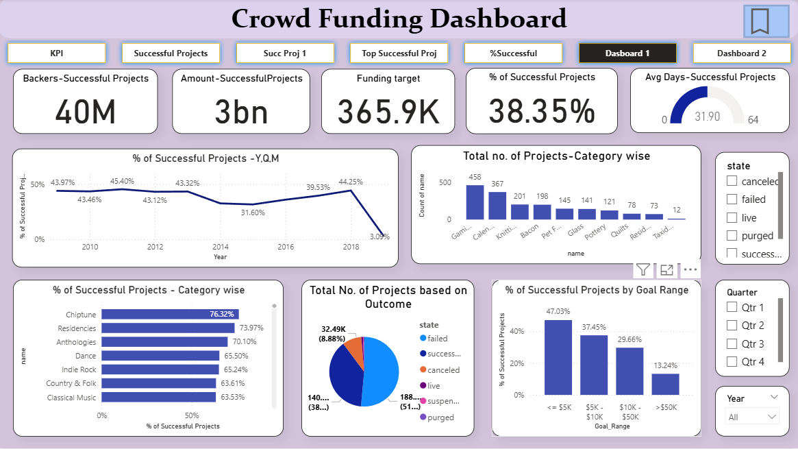
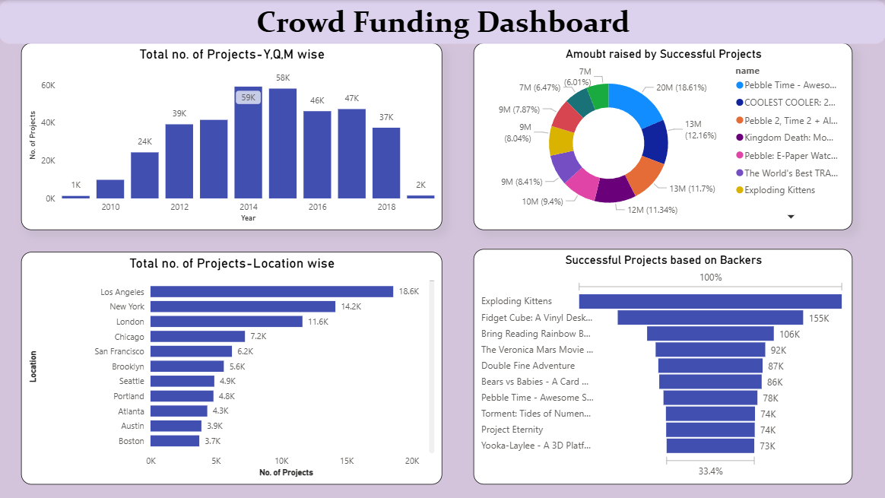
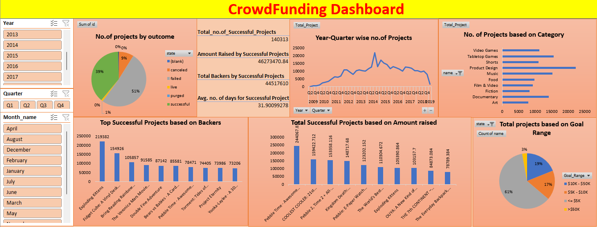

# 📊 Crowdfunding Data Analysis & Dashboard

This project provides insights into global crowdfunding trends using **Power BI, Excel, Tableau, and SQL**. Multiple dashboards were created to analyze project outcomes, funding performance, category-wise success, and backer behavior.

---

## ✅ Project Objectives

- Analyze crowdfunding trends across **years, locations, and categories**
- Identify **successful vs failed** projects
- Visualize key performance metrics
- Highlight **top-performing projects**
- Use **Excel, MySQL, Power BI, and Tableau** for analysis and visualization

---

## 🛠️ Tools & Technologies Used

| Tool / Technology | Purpose |
|-------------------|--------|
| **Power BI** | Interactive dashboards |
| **Excel** | Data cleaning & visualization |
| **Tableau** | Visual analytics |
| **MySQL** | Querying & data extraction |
| **Power Query / DAX** | Data transformation |

---

## 📂 Dashboards Preview

### ✅ Dashboard 1 (Power BI)

### ✅ Dashboard 2 (Power BI)

### ✅ Excel Dashboard

> 📝 Replace the filenames above (dashboard1.png, etc.) with your actual image names after uploading.

---

## 🔍 Key Insights

### ✅ KPIs
- **Total Backers:** 40M+
- **Total Funding by Successful Projects:** $3B+
- **Success Rate:** 38.35%
- **Avg Duration (Successful Projects):** 31.9 days

### ✅ Category Performance
Top performing categories by success rate:
- Chiptune – 76.29%
- Residencies – 73.97%
- Anthologies – 70.10%

Highest number of projects:
- Product Design
- Tabletop Games
- Video Games

### ✅ Funding Goal Success Rate
| Goal Range | Success % |
|------------|-----------|
| ≤ $5K      | 47.03% |
| $5K–$10K   | 37.45% |
| $10K–$50K  | 29.66% |
| > $50K     | 13.24% |

### ✅ Top Projects by Backers
- Exploding Kittens
- Fidget Cube
- Pebble Time
- Veronica Mars Movie

### ✅ Location Insights
Most active cities:
- Los Angeles
- New York
- London
- Chicago

---

## 📁 Project Structure

